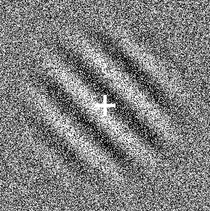

# jspsych-gabor-stimulus-plugin

This project aims to provide a jsPsych plugin for generating gabor patch stimuli. Once it reaches reasonable stability, test coverage and usability, it will be proposed to the jsPsych team for integration into the main codebase.

## How to use

### Install

For now, the plugin can be installed from npm:

```shell
$ yarn add @kogpsy/jspsych-gabor-stimulus-plugin
```

### Example

```javascript
// Import plugin and config type
import GaborStimulusPlugin from '@kogpsy/jspsych-gabor-stimulus-plugin';

// ...

// Define configuration object
const config = {
  stimulus: {
    size: 200,
    rotation: 45,
  },
  fixationCross: {
    size: 20,
    weight: 4,
    color: 'white',
  },
};

// Push the plugin to the timeline
timeline.push({
  type: GaborStimulusPlugin,
  config: config,
});
```

This will produce the following result:


### TypeScript

There is a type available for the configuration object which is exported as `GaborStimulusPluginConfig` by the plugin. It can be used to make configuring more convenient and robust.

### Configuration reference

The configuration object allows broad control over how the gabor patch generated. You can control the stimulus itself using the `stimulus` key, the aperture using the `aperture` key, the background using the `background` key, a possible fixation cross using the `fixationCross` key, stimulus timing using the `timing` key and the possible keyboard responses using the `choices` key:

```typescript
const conf: GaborStimulusPluginConfig = {
  stimulus: {
    // ...
  },
  aperture: {
    // ...
  }
  background: {
    // ...
  }
  fixationCross: {
    // ...
  },
  timing: {
    // ...
  },
  choices: [/* ... */]
};
```

Each of these keys takes an object which is explored in the following.

#### `stimulus`

The stimulus itself consists of alternating white and black lines. The transitions between the colors are smooth and follow a sinusoidal curve.

You can control the appearance of the stimulus using a multitude of parameters:

| Field         | Description                                                        | Unit                   | Type     | Default    |
| ------------- | ------------------------------------------------------------------ | ---------------------- | -------- | ---------- |
| `size`        | Width and height of the gabor patch                                | Pixels                 | `number` | `200`      |
| `density`     | Density of the gabor patch                                         | Sine curve repetitions | `number` | `5`        |
| `phaseOffset` | Offset of the sine curve (and hence also color pattern)            | Degrees (0 to 359)     | `number` | `0`        |
| `opacity`     | Opacity of the gabor patch                                         | Decimal (0 to 1)       | `number` | `1`        |
| `rotation`    | Rotation of the gabor patch                                        | Degrees (0 to 359)     | `number` | `0`        |
| `blendMode`   | [CSS blend mode][1] used to blend the stimulus onto the background | Blend mode name        | `string` | `"normal"` |

#### `aperture`

The stimulus above is rendered using a square-shaped SVG element. A traditional gabor patch is circular with smooth edges. This is achieved using an aperture and blurring it.

You can control the aperture radius and blur using these parameters:

| Field    | Description                                                        | Unit                               | Type     | Default             |
| -------- | ------------------------------------------------------------------ | ---------------------------------- | -------- | ------------------- |
| `radius` | Radius of the circular aperture                                    | Pixels                             | `number` | `stimulus.size / 4` |
| `blur`   | Blur strength applied to the aperture using a Gaussian blur filter | Standard deviation of the gaussian | `number` | `stimulus.size / 8` |

#### `fixationCross`

There is the possibility to display a fixation cross in the middle of the stimulus. To do so, add a `fixationCross`key to the configuration object.

You can also control how it looks with the following parameters:

| Field    | Description                            | Unit                | Type     | Default   |
| -------- | -------------------------------------- | ------------------- | -------- | --------- |
| `size`   | Width and height of the fixation cross | Pixels              | `number` | `30`      |
| `weight` | Weight of the fixation cross lines     | Pixels              | `number` | `5`       |
| `color`  | Color of the fixation cross            | Any valid css color | `string` | `"white"` |

#### `background`

There are different background types available. You can control the type by setting the value uf the `type` key on the background object to one of the strings shown below. Depending on the type, different, further configuration options are available.

- `type: "css-color"`
- `type: "image"`
- `type: "animation"`

The configuration options for each type are presented in the following:

_`type: "css-color"`_

This is the default background type, with the color parameter set to `transparent` resulting in a transparent background.

| Field   | Description                 | Unit                | Type     | Default         |
| ------- | --------------------------- | ------------------- | -------- | --------------- |
| `color` | The color of the background | Any valid css color | `string` | `"transparent"` |

_`type: "image"`_

| Field    | Description                              | Unit                        | Required | Type     | Default     |
| -------- | ---------------------------------------- | --------------------------- | -------- | -------- | ----------- |
| `source` | Source of the image to use as background | Either a path or a data url | Yes      | `string` | `undefined` |

_`type: "animation"`_

| Field    | Description             | Unit                        | Required | Type       | Default     |
| -------- | ----------------------- | --------------------------- | -------- | ---------- | ----------- |
| `frames` | Frames of the animation | Either paths or a data urls | Yes      | `string[]` | `undefined` |
| `fps`    | Speed of the animation  | Frames per second           | No       | `number`   | `60`        |

#### `timing`

The timing of the stimulus and trial is pretty flexible. Stimulus timing corresponds to how long the stimulus itself (gabor patch and background) is displayed, while trial timing corresponds to how long responses are captured.

These options are available:

| Field               | Description                                                       | Unit                                               | Type      | Default |
| ------------------- | ----------------------------------------------------------------- | -------------------------------------------------- | --------- | ------- |
| `stimulusDuration`  | Time during which the stimulus is displayed                       | Milliseconds (`0` or negative values for infinite) | `number`  | `0`     |
| `trialDuration`     | Time after which the trial is ended                               | Milliseconds (`0` or negative values for infinite) | `number`  | `0`     |
| `responseEndsTrial` | Controls whether the trial is ended when the participant responds | Boolean                                            | `boolean` | `true`  |

#### `choices`

The plugin is capable of capturing keyboard responses. To control allowed keys, the `choices` array is used. To allow the `F` and the `J` keys, for example, set the value of the `choices` key like that:

```javascript
const conf = {
  // Your other options
  // ...

  // Set choices
  choices: ['f', 'j'],
};
```

As for valid key codes, this plugin follows the conventions of other jsPsych plugins. The [jsPsych documentation on the KeyBoardResponsePlugin][2] states the following:

> Keys should be specified as characters (e.g., `'a'`, `'q'`, `' '`, `'Enter'`, `'ArrowDown'`) - see [this page][3] and [this page][4] (event.key column) for more examples.

Per default, no keys are allowed.

### A more complete example

This is a more complete example demonstrating how to use many of the options discussed above. The `backgroundFrames` array is generated using the integrated background noise generator (see below).

```javascript
const gaborConf = {
  stimulus: {
    size: 300,
    density: 6,
    opacity: 1,
    phaseOffset: 0,
    rotation: 45,
    blendMode: 'overlay',
  },
  aperture: {
    radius: 100,
    blur: 25,
  },
  background: {
    type: 'animation',
    frames: backgroundFrames,
    fps: 10,
  },
  fixationCross: {
    size: 30,
    weight: 5,
    color: 'white',
  },
  choices: [], // No keys
  timing: {
    trialDuration: 250,
    responseEndsTrial: false,
  },
};
```

This will result in a stimulus looking like that (with the background being animated, of course):



### Integrated background noise generator

This plugin comes with an integrated background noise generated used to generate either single images with random noise or multiple frames used to animate the background.

You can import and use the generator functions like this:

```javascript
import {
  generateNoise,
  generateNoiseFrames,
} from '@kogpsy/jspsych-gabor-stimulus-plugin';

// Generate a single background image (the parameters correspond to its width
// and height)
const noisyBackgroundImage = generateNoise(300, 300);

// Generate multiple background frames (the parameters correspond to their width
// and height, as well as the number of frames)
const noisyBackgroundFrames = generateNoiseFrames(300, 300, 20);
```

### Data saved by the plugin

The following data are collected:

- `response`: The key pressed by the participant
- `rt`: The reaction time

[1]: https://developer.mozilla.org/en-US/docs/Web/CSS/mix-blend-mode
[2]: https://www.jspsych.org/7.2/plugins/html-keyboard-response/
[3]: https://developer.mozilla.org/en-US/docs/Web/API/KeyboardEvent/key/Key_Values
[4]: https://www.freecodecamp.org/news/javascript-keycode-list-keypress-event-key-codes/
